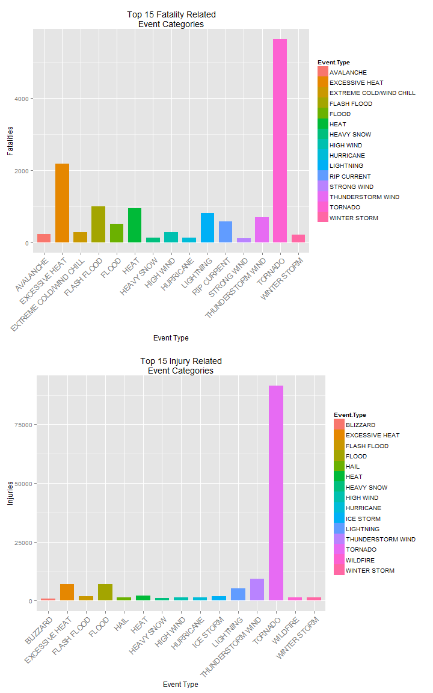

# Initial Setup

This preliminary code loads the required libraries and initializes some constants It then downloads and unzips the source data file.


```r
library(R.utils)        # for bunzip2
library(data.table)
library(dplyr)
library(tidyr)
library(RColorBrewer)
library(ggplot2)
library(xtable)
library(gridExtra)

# The URL of the source data file.

data.file.URL <- "https://d396qusza40orc.cloudfront.net/repdata%2Fdata%2FStormData.csv.bz2"
target.file <- "StormData.csv.bz2"

# From the Storm Event Table on pg 6 NWSI 10-1605 AUGUST 17, 2007

weather_event_labels <- toupper(c("Astronomical Low Tide",  "Avalanche",
                          "Blizzard", "Coastal Flood",
                          "Cold/Wind Chill", "Debris Flow",
                          "Dense Fog", "Dense Smoke",
                          "Drought", "Dust Devil",
                          "Dust Storm", "Excessive Heat",
                          "Extreme Cold/Wind Chill", "Flash Flood",
                          "Flood", "Frost/Freeze",
                          "Funnel Cloud", "Freezing Fog",
                          "Hail", "Heat",
                          "Heavy Rain", "Heavy Snow",
                          "High Surf", "High Wind",
                          "Hurricane (Typhoon)", "Ice Storm",
                          "Lake-Effect Snow", "Lakeshore Flood",
                          "Lightning", "Marine Hail",
                          "Marine High Wind", "Marine Strong Wind",
                          "Marine Thunderstorm Wind", "Rip Current",
                          "Seiche", "Sleet",
                          "Storm Surge/Tide", "Strong Wind",
                          "Thunderstorm Wind", "Tornado",
                          "Tropical Depression", "Tropical Storm",
                          "Tsunami", "Volcanic Ash",
                          "Waterspout", "Wildfire",
                          "Winter Storm", "Winter Weather"))


#download.file(data.file.URL, target.file)
#bunzip2(target.file)
StormData <- data.table(read.csv("StormData.csv"))

# Collapse all of the different Hurricanes names into a list so that
# we can have a generic "Hurricane Category

StormData %>% filter(grepl("Hurricane|HURRICANE",EVTYPE)) -> HurricaneData
Hurricanes <- unique(as.character(HurricaneData$EVTYPE))
```


## Process the data


```r
# Clean the data.  Converting the older event types into the modern
# event types where it is reasonable to do so.

StormData %>%
    mutate(EVTYPE = as.character(EVTYPE)) %>%
    mutate(Event.Type = ifelse(EVTYPE %in% weather_event_labels, EVTYPE, "OTHER")) %>%
    mutate(Event.Type = ifelse(EVTYPE %in% Hurricanes, "HURRICANE", Event.Type )) %>%
    mutate(Event.Type = ifelse(EVTYPE == "TSTM WIND", "THUNDERSTORM WIND", Event.Type)) %>%
    mutate(Event.Type = ifelse(EVTYPE == "THUNDERSTORM WINDS", "THUNDERSTORM WIND", Event.Type)) %>%
    mutate(Event.Type = ifelse(EVTYPE == "HIGH WINDS", "HIGH WIND", Event.Type)) %>%
    mutate(Event.Type = ifelse(EVTYPE == "WILD/FOREST FIRE", "WILDFIRE", Event.Type)) %>%
    mutate(Event.Type = ifelse(EVTYPE == "FLASH FLOODING", "FLASH FLOOD", Event.Type)) %>%
    mutate(Event.Type = ifelse(EVTYPE == "URBAN/SML STREAM FLD", "FLOOD", Event.Type)) %>%
    mutate(Event.Type = ifelse(EVTYPE == "EXTREME COLD", "EXTREME COLD/WIND CHILL", Event.Type)) %>%
    mutate(Event.Type = ifelse(EVTYPE == "FLOODING", "FLOOD", Event.Type)) %>%
    mutate(Event.Type = ifelse(EVTYPE == "RIP CURRENTS", "RIP CURRENT", Event.Type)) %>%
    mutate(Event.Type = ifelse(EVTYPE == "HEAT WAVE", "EXCESSIVE HEAT", Event.Type)) %>%
    mutate(Event.Type = ifelse(EVTYPE == "EXTREME HEAT", "EXCESSIVE HEAT", Event.Type)) %>%
    mutate(Event.Type = ifelse(Event.Type == "OTHER", paste("OTHER-", EVTYPE), Event.Type)) %>%
    select(Event.Type, Property.Damage = PROPDMG , Crop.Damage = CROPDMG, Fatalities = FATALITIES , Injuries = INJURIES) -> StormData.Cleaned

# Summarise the 4 different damage types.

StormData.Cleaned %>%
    select(Event.Type, Property.Damage) %>%
    group_by(Event.Type) %>%
    summarise_each(funs(sum)) %>%
    arrange(desc(Property.Damage)) -> Property.Summary

StormData.Cleaned %>%
    select(Event.Type, Crop.Damage) %>%
    group_by(Event.Type) %>%
    summarise_each(funs(sum)) %>%
    arrange(desc(Crop.Damage)) -> Crops.Summary

StormData.Cleaned %>%
    select(Event.Type, Fatalities) %>%
    group_by(Event.Type) %>%
    summarise_each(funs(sum)) %>%
    arrange(desc(Fatalities)) -> Fatalities.Summary

StormData.Cleaned %>%
    select(Event.Type, Injuries) %>%
    group_by(Event.Type) %>%
    summarise_each(funs(sum)) %>%
    arrange(desc(Injuries)) -> Injuries.Summary
```

## Crop Damage

Cost is in dollars, not adjusted for inflation.


```r
xt <- xtable(head(Property.Summary, 15))

print(xt, floating=FALSE, type="html", include.rownames=FALSE)
```

<!-- html table generated in R 3.2.1 by xtable 1.7-4 package -->
<!-- Fri Oct 23 22:39:12 2015 -->
<table border=1>
<tr> <th> Event.Type </th> <th> Property.Damage </th>  </tr>
  <tr> <td> TORNADO </td> <td align="right"> 3212258.16 </td> </tr>
  <tr> <td> THUNDERSTORM WIND </td> <td align="right"> 2659102.96 </td> </tr>
  <tr> <td> FLASH FLOOD </td> <td align="right"> 1448621.74 </td> </tr>
  <tr> <td> FLOOD </td> <td align="right"> 931454.32 </td> </tr>
  <tr> <td> HAIL </td> <td align="right"> 688693.38 </td> </tr>
  <tr> <td> LIGHTNING </td> <td align="right"> 603351.78 </td> </tr>
  <tr> <td> HIGH WIND </td> <td align="right"> 380356.56 </td> </tr>
  <tr> <td> WINTER STORM </td> <td align="right"> 132720.59 </td> </tr>
  <tr> <td> WILDFIRE </td> <td align="right"> 123804.29 </td> </tr>
  <tr> <td> HEAVY SNOW </td> <td align="right"> 122251.99 </td> </tr>
  <tr> <td> ICE STORM </td> <td align="right"> 66000.67 </td> </tr>
  <tr> <td> STRONG WIND </td> <td align="right"> 62993.81 </td> </tr>
  <tr> <td> HEAVY RAIN </td> <td align="right"> 50842.14 </td> </tr>
  <tr> <td> TROPICAL STORM </td> <td align="right"> 48423.68 </td> </tr>
  <tr> <td> BLIZZARD </td> <td align="right"> 25318.48 </td> </tr>
   </table>

## Property Damage

Cost is in dollars, not adjusted for inflation.


```r
xt <- xtable(head(Crops.Summary, 15))

print(xt, floating=FALSE, type="html", include.rownames=FALSE)
```

<!-- html table generated in R 3.2.1 by xtable 1.7-4 package -->
<!-- Fri Oct 23 22:39:12 2015 -->
<table border=1>
<tr> <th> Event.Type </th> <th> Crop.Damage </th>  </tr>
  <tr> <td> HAIL </td> <td align="right"> 579596.28 </td> </tr>
  <tr> <td> THUNDERSTORM WIND </td> <td align="right"> 194678.98 </td> </tr>
  <tr> <td> FLASH FLOOD </td> <td align="right"> 184326.51 </td> </tr>
  <tr> <td> FLOOD </td> <td align="right"> 174192.68 </td> </tr>
  <tr> <td> TORNADO </td> <td align="right"> 100018.52 </td> </tr>
  <tr> <td> DROUGHT </td> <td align="right"> 33898.62 </td> </tr>
  <tr> <td> HIGH WIND </td> <td align="right"> 19042.81 </td> </tr>
  <tr> <td> HEAVY RAIN </td> <td align="right"> 11122.80 </td> </tr>
  <tr> <td> HURRICANE </td> <td align="right"> 10812.79 </td> </tr>
  <tr> <td> WILDFIRE </td> <td align="right"> 8553.74 </td> </tr>
  <tr> <td> FROST/FREEZE </td> <td align="right"> 7034.14 </td> </tr>
  <tr> <td> EXTREME COLD/WIND CHILL </td> <td align="right"> 6171.14 </td> </tr>
  <tr> <td> TROPICAL STORM </td> <td align="right"> 5899.12 </td> </tr>
  <tr> <td> OTHER- TSTM WIND/HAIL </td> <td align="right"> 4356.65 </td> </tr>
  <tr> <td> LIGHTNING </td> <td align="right"> 3580.61 </td> </tr>
   </table>


```r
p1 <- ggplot(head(Property.Summary, 15), aes(x=Event.Type, y = Property.Damage, fill=Event.Type)) + 
    geom_bar(stat="identity", width=.75, position=position_dodge(width=.8)) +
    xlab("Event Type") + ylab("Property Damage in Dollars") +
    ggtitle("Top 15 Property Damage Related Event Categories") +
    theme(axis.text.x = element_blank())

p2 <- ggplot(head(Crops.Summary, 15), aes(x=Event.Type, y = Crops.Damage, fill=Event.Type)) + 
    geom_bar(stat="identity", width=.75, position=position_dodge(width=.8)) +
    xlab("Event Type") + ylab("Crop Damage in Dollars") +
    ggtitle("Top 15 Crop Damage Related Event Categories") +
    theme(axis.text.x = element_blank())

grid.arrange(p1, p2, ncol=2, nrow =1)
```

```
## Error in eval(expr, envir, enclos): object 'Crops.Damage' not found
```


## Injuries


```r
xt <- xtable(head(Injuries.Summary, 15))
print(xt, floating=FALSE, type="html", include.rownames = FALSE)
```

<!-- html table generated in R 3.2.1 by xtable 1.7-4 package -->
<!-- Fri Oct 23 22:39:16 2015 -->
<table border=1>
<tr> <th> Event.Type </th> <th> Injuries </th>  </tr>
  <tr> <td> TORNADO </td> <td align="right"> 91346.00 </td> </tr>
  <tr> <td> THUNDERSTORM WIND </td> <td align="right"> 9353.00 </td> </tr>
  <tr> <td> EXCESSIVE HEAT </td> <td align="right"> 6989.00 </td> </tr>
  <tr> <td> FLOOD </td> <td align="right"> 6870.00 </td> </tr>
  <tr> <td> LIGHTNING </td> <td align="right"> 5230.00 </td> </tr>
  <tr> <td> HEAT </td> <td align="right"> 2100.00 </td> </tr>
  <tr> <td> ICE STORM </td> <td align="right"> 1975.00 </td> </tr>
  <tr> <td> FLASH FLOOD </td> <td align="right"> 1785.00 </td> </tr>
  <tr> <td> WILDFIRE </td> <td align="right"> 1456.00 </td> </tr>
  <tr> <td> HIGH WIND </td> <td align="right"> 1439.00 </td> </tr>
  <tr> <td> HAIL </td> <td align="right"> 1361.00 </td> </tr>
  <tr> <td> HURRICANE </td> <td align="right"> 1328.00 </td> </tr>
  <tr> <td> WINTER STORM </td> <td align="right"> 1321.00 </td> </tr>
  <tr> <td> HEAVY SNOW </td> <td align="right"> 1021.00 </td> </tr>
  <tr> <td> BLIZZARD </td> <td align="right"> 805.00 </td> </tr>
   </table>

## Fatalities

```r
xt <- xtable(head(Fatalities.Summary, 15))
print(xt, floating=FALSE, type="html", include.rownames=FALSE)
```

<!-- html table generated in R 3.2.1 by xtable 1.7-4 package -->
<!-- Fri Oct 23 22:39:16 2015 -->
<table border=1>
<tr> <th> Event.Type </th> <th> Fatalities </th>  </tr>
  <tr> <td> TORNADO </td> <td align="right"> 5633.00 </td> </tr>
  <tr> <td> EXCESSIVE HEAT </td> <td align="right"> 2171.00 </td> </tr>
  <tr> <td> FLASH FLOOD </td> <td align="right"> 997.00 </td> </tr>
  <tr> <td> HEAT </td> <td align="right"> 937.00 </td> </tr>
  <tr> <td> LIGHTNING </td> <td align="right"> 816.00 </td> </tr>
  <tr> <td> THUNDERSTORM WIND </td> <td align="right"> 701.00 </td> </tr>
  <tr> <td> RIP CURRENT </td> <td align="right"> 572.00 </td> </tr>
  <tr> <td> FLOOD </td> <td align="right"> 504.00 </td> </tr>
  <tr> <td> EXTREME COLD/WIND CHILL </td> <td align="right"> 285.00 </td> </tr>
  <tr> <td> HIGH WIND </td> <td align="right"> 283.00 </td> </tr>
  <tr> <td> AVALANCHE </td> <td align="right"> 224.00 </td> </tr>
  <tr> <td> WINTER STORM </td> <td align="right"> 206.00 </td> </tr>
  <tr> <td> HURRICANE </td> <td align="right"> 135.00 </td> </tr>
  <tr> <td> HEAVY SNOW </td> <td align="right"> 127.00 </td> </tr>
  <tr> <td> STRONG WIND </td> <td align="right"> 103.00 </td> </tr>
   </table>


```r
p3 <- ggplot(head(Fatalities.Summary, 15), aes(x=Event.Type, y = Fatalities, fill=Event.Type)) + 
    geom_bar(stat="identity", width=.75, position=position_dodge(width=.8)) +
    xlab("Event Type") + ylab("Fatalities") +
    ggtitle("Top 15 Fatality Related Event Categories") +
    theme(axis.text.x = element_blank())

p4 <- ggplot(head(Injuries.Summary, 15), aes(x=Event.Type, y = Injuries, fill=Event.Type)) + 
    geom_bar(stat="identity", width=.75, position=position_dodge(width=.8)) +
    xlab("Event Type") + ylab("Injuries") +
    ggtitle("Top 15 Injury Related Event Categories") +
    theme(axis.text.x = element_blank())

grid.arrange(p3, p4, ncol=2, nrow =1)
```


